# Calculator app

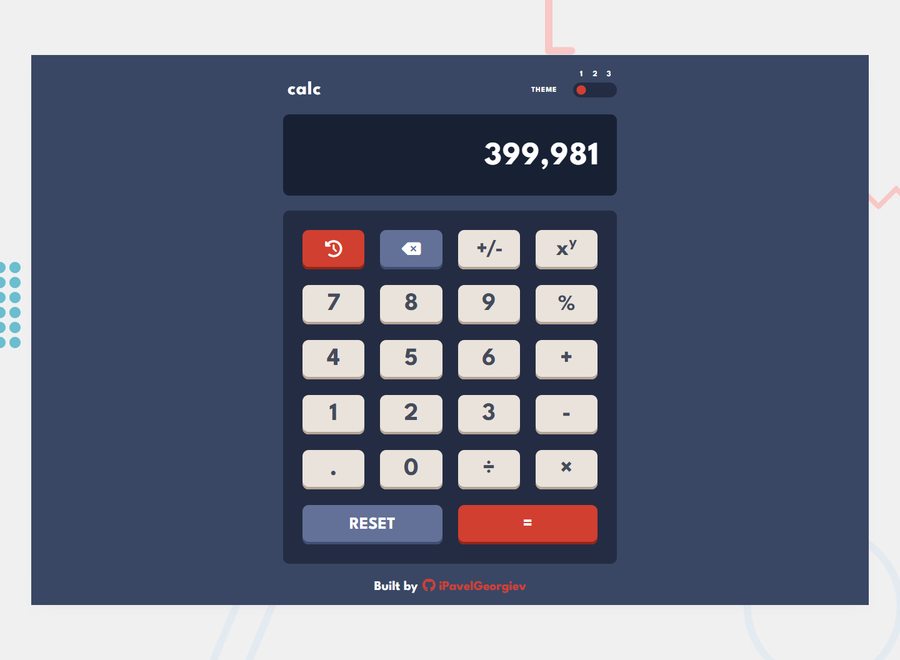

## Overview

The calculator app allows users to perform basic mathematical operations such as addition, subtraction, multiplication, division, modulo division, and exponentiation. In addition, the app includes a history feature that stores all previous calculations for easy reference. Users can also customize the appearance of the app by choosing from three different themes.

The selected theme and calculation history are saved as localStorage values, which allows users to retain their preferred theme and previous calculations even when the app is closed and reopened. This ensures that users can easily switch between themes and review their past calculations without having to start over every time they use the app.

### Screenshots

<details>
  <summary>Desktop design: theme one</summary>

  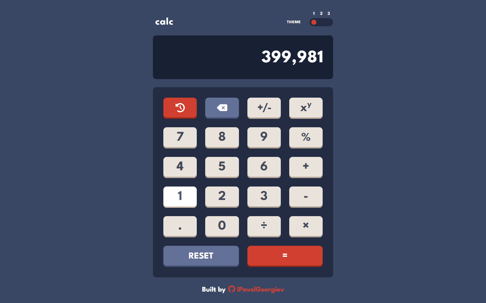
  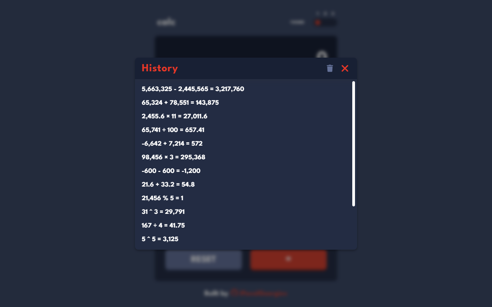
</details>

<details>
  <summary>Desktop design: theme two</summary>

  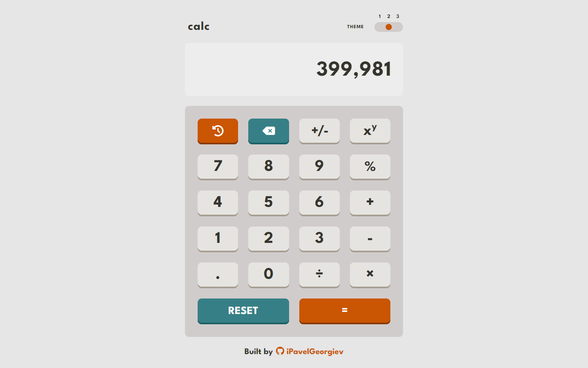
  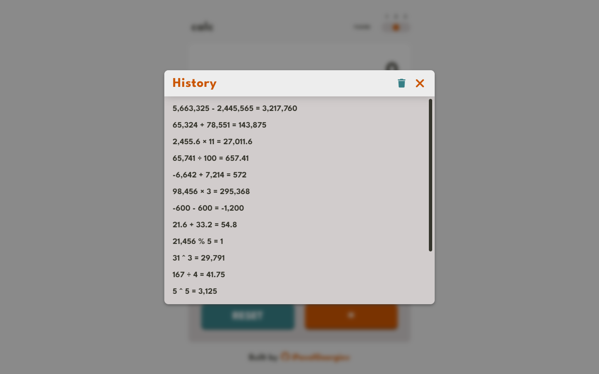
</details>

<details>
  <summary>Desktop design: theme three</summary>

  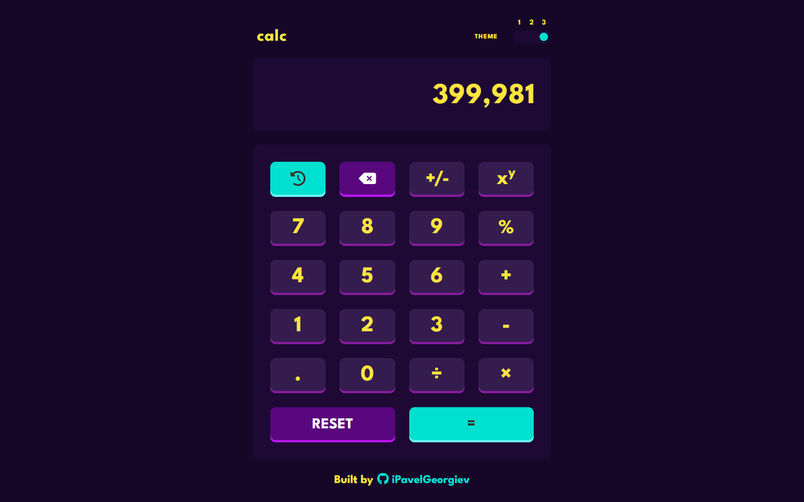
  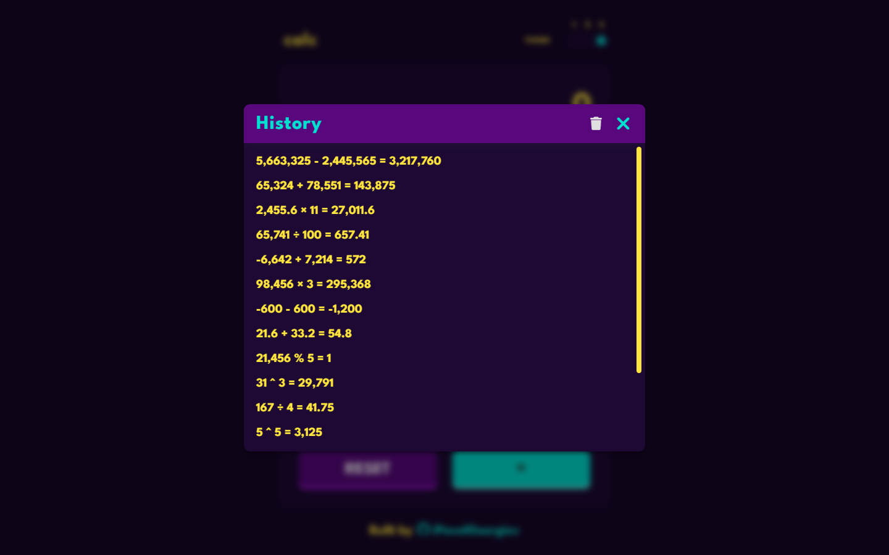
</details>
&nbsp;
<details>
  <summary>Mobile design: theme one</summary>

  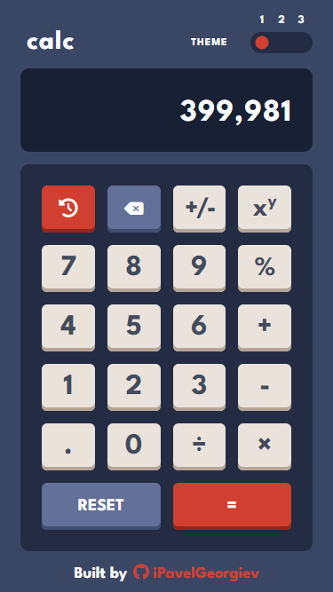
  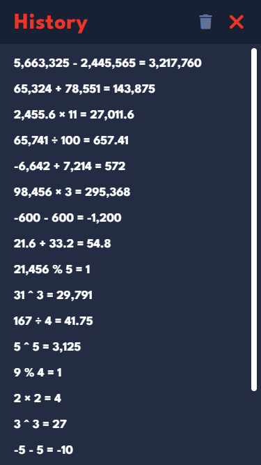
</details>

<details>
  <summary>Mobile design: theme two</summary>

  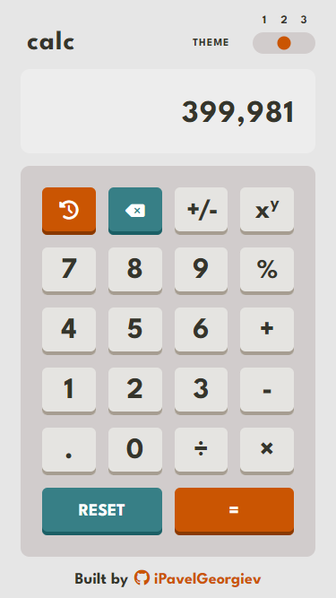
  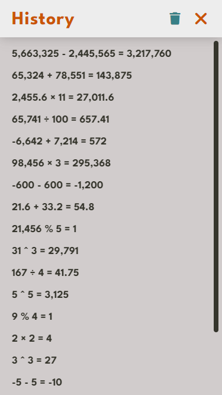
</details>

<details>
  <summary>Mobile design: theme three</summary>

  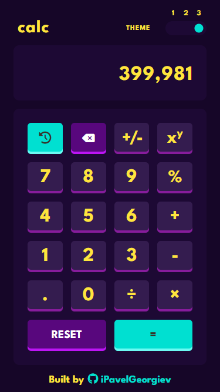
  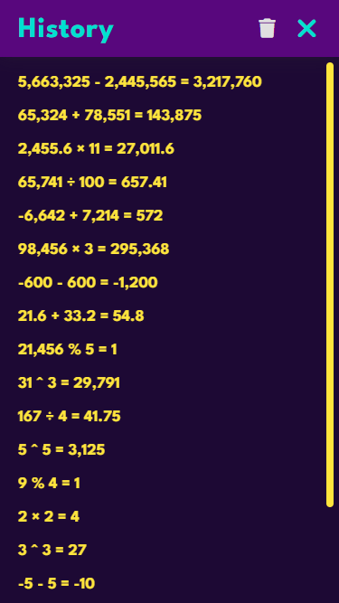
</details>

### Built With

- Semantic HTML5 markup
- SCSS
- JavaScript

## Run Locally

Clone the project

```bash
  git clone https://github.com/iPavelGeorgiev/calculator-app.git
```

Go to the project directory

```bash
  cd calculator-app
```

Install dependencies

```bash
  npm install
```

Start the server

```bash
  npm run start
```

## Acknowledgements

This [challenge](https://www.frontendmentor.io/challenges/calculator-app-9lteq5N29) was provided by [Frontend Mentor](https://www.frontendmentor.io), a platform that offers challenges to help developers practice and improve their frontend skills. Each challenge includes designs for both mobile and desktop, as well as assets and a style guide, to get you started. This provides an opportunity for developers to concentrate on the implementation without having to worry about the design.

## Author

<p><a href="https://www.linkedin.com/in/ipavelgeorgiev/"></a>&nbsp;
<a href="https://discord.com/users/621026020895621123"></a>&nbsp;
<a href="https://www.frontendmentor.io/profile/iPavelGeorgiev"></a></p>
